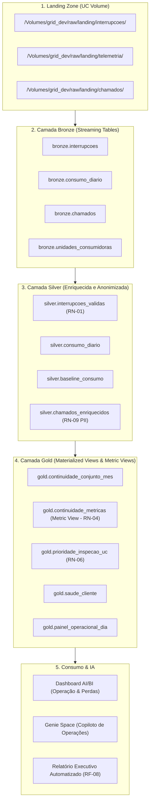

# Grid Intelligence — Lakehouse Elétrico e Copiloto de Operações

 Plataforma Lakehouse end-to-end desenvolvida na **Databricks** com **Declarative Automation Bundles (DABs)** para a distribuidora fictícia **Luz do Vale**. 

A plataforma consolida o fluxo medalhão (Bronze, Silver e Gold), Metric Views do Unity Catalog, um Dashboard AI/BI de alta definição e um Copiloto de Operações inteligente baseado no **Databricks Genie**.

---

## 🏗️ Arquitetura do Lakehouse



---

## 📋 Pré-requisitos

1. **Databricks CLI**: Versão `>= 0.220.0` instalada.
2. **Perfil da CLI**: Perfil configurado para o workspace de desenvolvimento (`grid_intelligence`).
3. **Databricks Workspace**: Com suporte a Unity Catalog, Serverless Compute e SQL Warehouse Pro/Serverless (`c2d015b31194d84d`).
4. **Python**: Versão `3.10+` com `databricks-sdk` instalado.

---

## ⚙️ Configuração do Perfil CLI

Se ainda não tiver configurado o perfil do CLI:

```bash
databricks configure --profile grid_intelligence
```

---

## 🚀 Sequência de Comandos (Do Zero ao Copiloto)

### 1. Clonar o Repositório
```bash
git clone https://github.com/Rodolfoxxv/LakehouseDatabricks.git
cd LakehouseDatabricks/grid_intelligence
```

### 2. Validar o Automation Bundle (DABs)
```bash
databricks bundle validate --profile grid_intelligence
```

### 3. Implantar a Infraestrutura e os Pipelines no Databricks
```bash
databricks bundle deploy -t dev --profile grid_intelligence
```

### 4. Executar o Pipeline Medalhão (Bronze → Silver → Gold)
```bash
databricks bundle run grid_pipeline -t dev --profile grid_intelligence
```

### 5. Implantar o Genie Space (Copiloto de Operações)
```bash
python src/genie/deploy_genie_space.py --catalog grid_dev --profile grid_intelligence
```

---

## 📂 Estrutura de Pastas do Repositório

```text
grid_intelligence/
├── databricks.yml                            # Configuração raiz do DABs
├── AGENTS.md                                 # Convenções e instruções para Agentes de IA
├── README.md                                 # Documentação executiva e técnica
├── prompts/                                  # Especificações de requisitos (Prompts 00 a 07)
├── resources/                                # Recursos do bundle (Pipelines e Dashboards)
│   ├── grid_pipeline.pipeline.yml            # Definição do Lakeflow Declarative Pipeline
│   ├── grid_dashboard.dashboard.yml          # Mapeamento do Dashboard AI/BI no DABs
│   └── grid_dashboard.json                   # Especificação visual do Dashboard (2 páginas)
├── src/
│   ├── genie/                                # Definição e scripts de implantação do Genie Space
│   │   ├── grid_agent.json                   # Especificação versionada do Genie Space (${catalogo})
│   │   ├── space_definition.json             # Definição alternativa sincronizada
│   │   ├── deploy_genie_space.py             # Script idempotente de deploy via Databricks CLI/SDK
│   │   └── apply_space.py                    # Script auxiliar de aplicação do espaço
│   ├── notebooks/                            # Notebooks de demonstração e relatórios executivos
│   │   ├── 07_demonstracao_plataforma.sql    # As 8 consultas SQL que provam toda a plataforma
│   │   └── 24_gold_relatorio_executivo.py    # Gerador de relatório executivo com ai_gen (RF-08)
│   ├── pipelines/grid_intelligence/
│   │   └── transformations/                  # Transformações SQL/Python do Pipeline Medalhão
│   │       ├── 01_bronze_streaming.py        # Ingestão contínua para Bronze (Auto Loader)
│   │       ├── 11_silver_interrupcoes.sql    # Regra RN-01 de filtragem de interrupções
│   │       ├── 12_silver_consumo.sql         # Limpeza e sanitização de consumo diário
│   │       ├── 13_silver_chamados.py         # Mascaramento Regex de PII (RN-09) e enriquecimento
│   │       ├── 21_gold_prioridade_inspecao.sql # Priorização técnica de inspeção em 2 eixos (RN-06)
│   │       ├── 22_gold_saude_cliente.sql     # Consolidado de relacionamento e risco ouvidoria
│   │       └── 23_gold_painel_operacional.sql# Visão operacional integrada conjunto x dia
│   └── sql/
│       └── metric_view_continuidade.sql      # Metric View oficial Unity Catalog (RN-04)
```

---

## 📜 Regras de Negócio Fundamentais

- **RN-01 (Filtragem Regulatória de Interrupções)**: Interrupções menores que 3.0 minutos ou com datas/conjuntos inválidos são descartadas no Silver (`silver.interrupcoes_validas`).
- **RN-04 (Métrica Única de DEC e FEC)**: A Metric View `gold.continuidade_metricas` é a **única fonte da verdade** para os indicadores regulatórios DEC e FEC. Exige `MEASURE()` e `GROUP BY ALL`. É estritamente proibido calcular DEC/FEC na mão a partir de outras tabelas.
- **RN-06 (Priorização Técnica de Inspeção)**: Combina dois eixos: (1) Queda individual de consumo em relação ao baseline histórico e (2) Estabilidade do consumo do conjunto no mesmo período.
- **RN-07 (Conformidade Ética e Não-Acusação)**: UCs com consumo atípico são classificadas exclusivamente em prioridade de inspeção (`alta`, `media`, `baixa`). É **rigorosamente vedado** descrever clientes ou UCs como "fraude", "furto", "roubo" ou "irregularidade".
- **RN-09 (Proteção de PII)**: Transcrições de atendimento têm CPF e Telefone mascarados na camada Silver via expressões regulares.
- **RN-13 (Isolamento de Consumo)**: Dashboards, relatórios executivos e o Genie Space consomem **exclusivamente** a camada Gold.

---

## 🔗 Links Principais no Workspace

- **Dashboard AI/BI**: [Operação & Perdas Não-Técnicas](https://dbc-f17be7d2-b81c.cloud.databricks.com/dashboardsv3/01f19a95d46e181fbfc9b056cfaf88b4/published?w=7474648820194436)
- **Copiloto de Operações (Genie Space)**: [Genie Room](https://dbc-f17be7d2-b81c.cloud.databricks.com/genie/rooms/01f19a99629a15bcbab62aa8beb69b9b)
